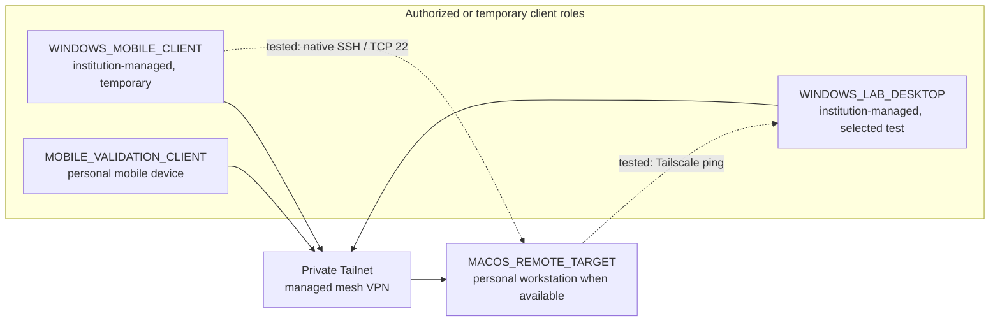

# Tailscale topology diagram

This diagram shows the public-safe device roles and recorded remote-access paths.

Last validated: **June 2026**.

No real Tailnet names, IP addresses, hostnames, account names, SSH fingerprints or organization-specific device identifiers are included.

## Interpretation

- the arrows into the Tailnet show enrollment during the recorded test period
- the dashed arrows show specific tested paths
- enrollment does not imply unrestricted traffic between every device pair
- the exact private access policy is not published
- the target least-privilege model requires only TCP 22 from the approved Windows client role to the macOS target

## Current baseline

- selected devices were visible in the Tailnet during the recorded test period
- selected Tailscale reachability was confirmed
- native SSH from the Windows mobile client to the macOS target was tested successfully
- no public port forwarding was configured
- no exit node, subnet router, Funnel, Serve or Tailscale SSH feature was enabled

## Trust boundary

Institution-managed devices are temporary clients whose enrollment depends on organizational permission and continued need. They should be removed or disabled when returned, reassigned, lost, compromised or no longer authorized.

## Availability boundary

The macOS target is a personal productive workstation. It is reachable only when powered on, connected, signed in where required and running the relevant services. The topology does not represent an availability commitment.
