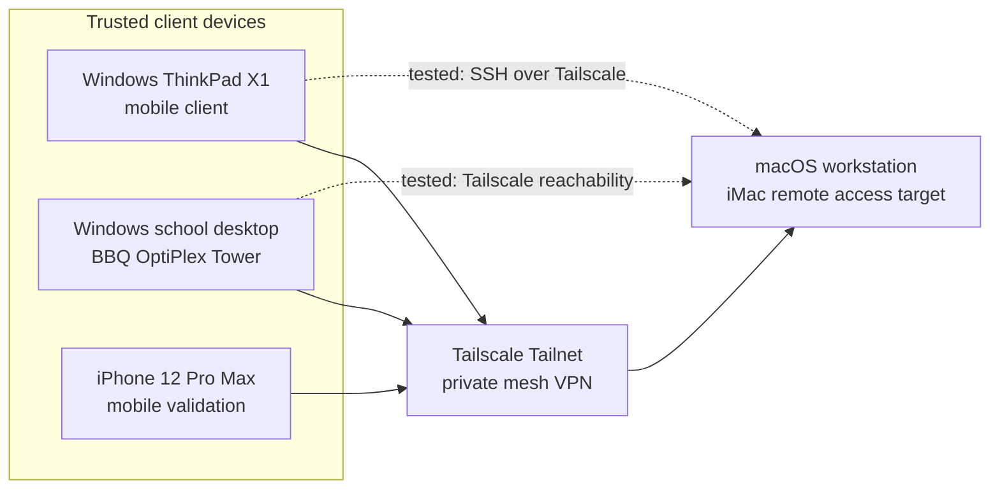

# Tailscale topology diagram

This diagram shows the anonymized remote-access topology used in the lab.

No real Tailscale IP addresses, private LAN addresses, SSH fingerprints or account-specific details are included.

## Current baseline

- All intended devices were enrolled in the same Tailnet.
- Device-to-device reachability was confirmed.
- SSH from the Windows ThinkPad to the macOS workstation was tested successfully.
- No public port forwarding was configured.
- No exit node, subnet router, Funnel, Serve or Tailscale SSH feature was enabled.
