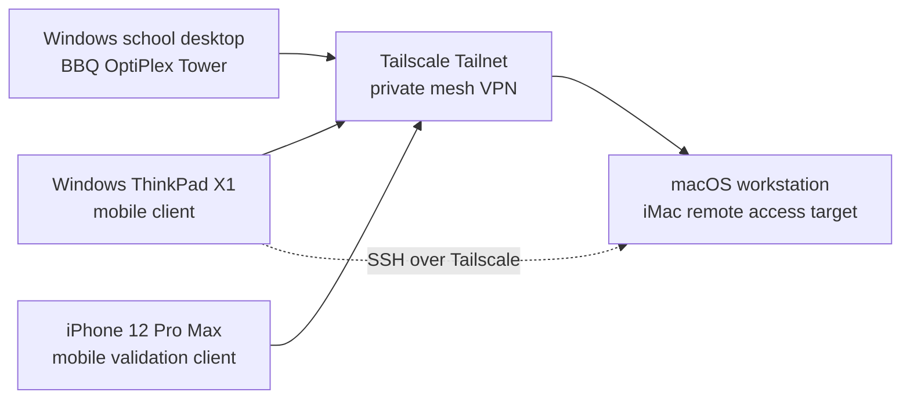

# Architecture

## Overview

This lab documents secure remote access between trusted personal devices.

The main design goal is to avoid exposing a personal workstation directly to the public internet while still allowing controlled access from trusted clients.

The current practical baseline uses Tailscale as a managed mesh VPN. WireGuard is kept as a separate learning path for understanding lower-level VPN concepts.

## Conceptual topology

## Device roles

| Role | Device type | Purpose |
|---|---|---|
| Target system | macOS workstation | Personal developer machine and intended always-on remote access target |
| Windows lab machine | BBQ OptiPlex Tower | School desktop, lab work, Git/GitHub workflow, Hyper-V and database-related tasks |
| Mobile Windows client | BBQ ThinkPad X1 | Mobile school/training device and remote access client |
| Mobile validation client | iPhone 12 Pro Max | Optional mobile connectivity validation |
| VPN layer | Tailscale Tailnet | Private device-to-device connectivity without public port forwarding |

## Approach A: Managed mesh VPN

A managed mesh VPN can simplify:

- device enrollment
- NAT traversal
- identity-based access
- key distribution
- remote access without router port forwarding
- practical operation across macOS, Windows and iOS

This is the preferred practical approach for daily use in this lab.

## Approach B: WireGuard lab

A WireGuard setup is useful for learning:

- peers
- key pairs
- AllowedIPs
- endpoint configuration
- persistent keepalive
- split tunnel versus full tunnel
- routing and firewall implications

This approach is treated as a technical lab and should not expose sensitive production systems without a clear security model.

## Design decision

For productive use, the safer and simpler managed approach is preferred.

For technical understanding, the WireGuard approach is documented separately as a learning exercise.

The macOS workstation is treated as a productive endpoint, not as a general-purpose public server.
