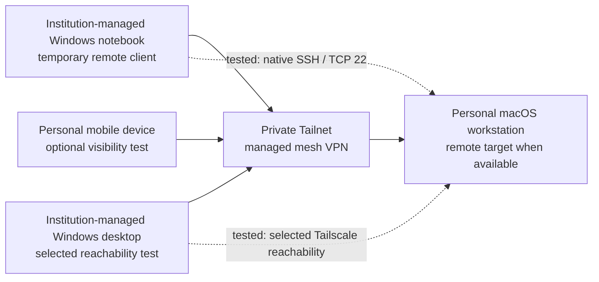

# Architecture

## Overview

This lab documents a narrow remote-access path between trusted or explicitly authorized devices.

The design goal is to reach a personal macOS workstation without exposing SSH directly to the public internet and without treating every enrolled device as equally or permanently trusted.

The current practical baseline uses Tailscale as a managed mesh VPN. WireGuard remains a separate learning path for lower-level VPN concepts.

Last validated: **June 2026**.

## Public-safe topology



The diagram shows enrolled roles and recorded test paths. It does not imply unrestricted communication among every device pair.

## Device roles

| Role | Trust context | Purpose |
|---|---|---|
| Personal remote target | macOS workstation | Developer workstation reachable only when powered on, signed in and available |
| Temporary managed client | Institution-managed Windows notebook | Authorized remote-access client for the documented SSH test |
| Managed lab workstation | Institution-managed Windows desktop | Selected reachability and school-context lab validation |
| Mobile validation client | Personal mobile device | Optional Tailnet visibility or connectivity check |
| Connectivity layer | Tailscale Tailnet | Private device-to-device transport without public port forwarding |

Institution-managed devices are not treated as permanent personal infrastructure. Their authorization and continued need must be reviewed.

## Access path

The intended minimal path is:

```text
approved managed client
        |
        | Tailscale transport
        | native SSH / TCP 22
        v
personal macOS target
```

The design does not require:

- client-to-client access
- access to unrelated personal systems
- subnet routing
- exit-node routing
- public ingress
- Tailscale SSH

See [Access-control model](access-control-model.md).

## Managed mesh VPN decision

The managed approach is preferred for the current practical baseline because it reduces operational complexity while supporting:

- authenticated device enrollment
- NAT traversal
- private addressing
- policy-based access control
- cross-platform operation
- remote access without router port forwarding

The exact private Tailnet policy is not published.

## WireGuard learning path

WireGuard remains useful for understanding:

- peers and key pairs
- `AllowedIPs`
- endpoints
- persistent keepalive
- split and full tunnels
- routing and firewall implications

No productive WireGuard server or public VPN endpoint is claimed.

## Availability boundary

The macOS workstation is a productive personal endpoint, not a server with an availability commitment. Remote access depends on:

- power state
- an active user session where required
- network connectivity
- Tailscale client state
- native SSH service state
- local access permissions

## Repository boundaries

This repository documents architecture, decisions, anonymized validation and public-safety rules. It does not publish:

- real hostnames or addresses
- a private Tailnet export
- account identities
- keys or fingerprints
- organization-specific device-management data
- complete internal topology
